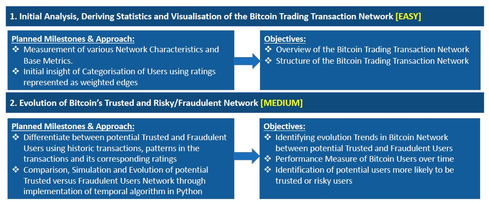
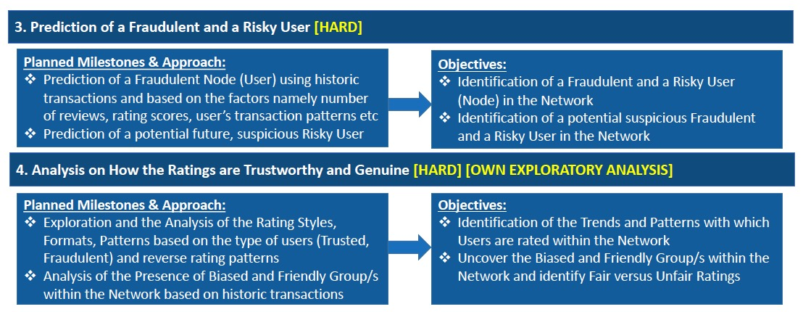
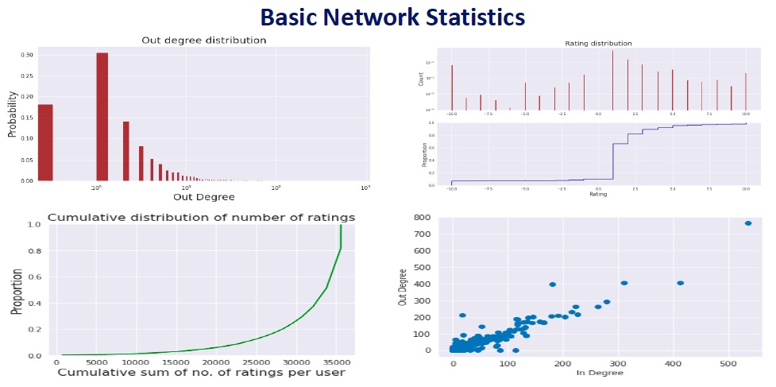

# Bitcoin_Network_Analytics_using_Python_NetworkX_and_Gephi

<h4>This project covers the network analysis covering 4 different problem statements and use cases using python NetworkX package, Gephi network analysis tool and Microsoft excel.  Dataset: Dataset includes Bitcoin Trade Transactions for the period between 2011 to 2016.</h4> 
  
<h3>Dataset Representation:</h3> 
<h4>Bitcoin Trade Transactions -> Attributes (Rater, Ratee, Rating and Timestamp)</h4>
  
<h3>Network Formation:</h3>
<h4>For every trade transaction between 2 users in the Bitcoin Network; ratings are recorded and tracked in the system with the corresponding timestamp (Directed Network).</h4>  
  
<h3>Size of the Dataset and Network:</h3> 
<h4>Users/Nodes = 5881 Transactions/Edges = 35592 Ratings (in the range of -10 to +10; where -10 represents the least rating and +10 represents the highest rating)</h4> 

<h3>Use Cases and Objectives:</h3>

  
<h3>Basic Network Statistics:</h3>  

<h4>This group project of 4 members is delivered as part of my Masters in Big Data Science (MSc BDS) Program Module named “Digital Media and Social Network” in Queen Mary University of London (QMUL), London, United Kingdom.</h4>
 
